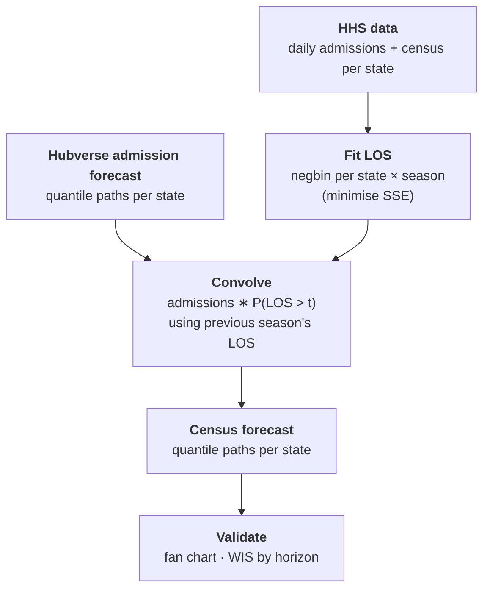

# Forecasting Hospital Burden from COVID-19

Turn hospital **admission** forecasts into hospital **census** forecasts, using a length-of-stay (LOS) distribution fitted per state and respiratory season.

---

## Goal

Given daily admissions, how many people are in the hospital today?

If we know how long patients stay, the census is just past admissions weighted by the chance each is still hospitalised:

$$
\text{census}(t) = \sum_{s \le t} \text{admissions}(s) \cdot P(\text{LOS} > t - s)
$$

We fit the LOS from historical admissions + census, then apply it to admission *forecasts* to get census forecasts.

---

## Pipeline



---

## Data

| Field | Description |
|---|---|
| Source | [HHS COVID-19 Reported Patient Impact and Hospital Capacity](https://healthdata.gov/Hospital/COVID-19-Reported-Patient-Impact-and-Hospital-Capa/g62h-syeh) |
| `admissions` | Daily new confirmed COVID hospital admissions (adult + pediatric) |
| `census` | Total confirmed COVID inpatients (adult + pediatric) |
| Granularity | Daily, per US state |

---

## Model

A parametric **negative-binomial LOS** (mean $\mu$, dispersion $\k$). The survival function $P(\text{LOS} > k)$ is convolved with admissions to predict census.

Other families (normal, lognormal, geometric) live in `distributions.R` for the accessory comparison; the production pipeline uses negbin only.

**`MAX_STAY = 50` days** ties together three things:
- length of the LOS survival vector,
- days discarded at the start of each state-season when fitting (census in this period depends on unobserved prior admissions),
- days of observed admissions prepended before each forecast, so the first forecast day already has a full 50-day history.

---

## Fitting

For each (state, season), minimise SSE between observed and predicted census using L-BFGS-B. Parameters are optimised in log space to stay positive. Uncertainty comes from a **residual bootstrap**: resample residuals, refit, repeat 100 times.

---

## Out-of-sample forecasting

We forecast census using LOS estimates from the previous season for a given state.
To forecast into **Winter 2024-25** we use the **Winter 2023-24** LOS fit; for **Summer 2024** we use **Summer 2023**.

---

## Validation

- **Fan chart** per (state, forecast_date): 50% + 95% prediction intervals for admissions and census, with observed overlaid.
- **WIS by horizon** via `scoringutils`, averaged per state.

---

## Project structure

```
source/
├── main.R                 # end-to-end pipeline
└── helpers/
    ├── packages.R         # library imports
    ├── data.R             # load_hhs(), load_hub()
    ├── seasons.R          # season_of(), previous_season()
    ├── distributions.R    # MAX_STAY + dist_* survival kernels
    ├── los.R              # predict_census(), fit_los(), fit_los_all()
    ├── forecast.R         # forecast_from_hub(), forecast_from_truth()
    ├── baseline.R         # baseline_from_observed() — rWIS reference
    ├── score.R            # score_forecast(), relative_wis(), WIS/rWIS plots
    └── plots.R            # plot_trajectories()
```

### NOTE FOR REVIEW
Convolution of quantiles holds exactly only if the admission-quantile paths are comonotonic across time (each quantile level is one coherent trajectory). The hub gives you per-date marginal quantiles, so you're implicitly assuming perfect rank correlation across horizons. That's the standard hub convention.

We are implicitly assuming:
The same trajectory sits at the same quantile level at every time point.
That is perfect rank correlation across time.