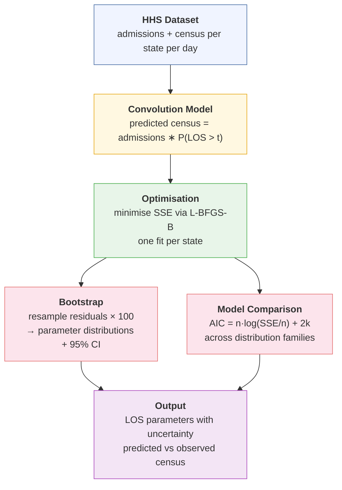

# Forecasting Hospital Burden from COVID-19

Estimate hospital length of stay (LOS) for COVID-19 across US states using a convolution model.

---

## Overview

The goal is to answer: **given daily hospital admissions, how well can we predict the number of people currently in hospital using a parametric LOS distribution?**

By fitting different distributions (negative binomial, normal, etc.) we recover the LOS parameters that best explain observed hospital census data — and compare which distributional family fits best.

---

## Pipeline



---

## Data

| Field | Description |
|---|---|
| **Source** | [HHS COVID-19 Reported Patient Impact and Hospital Capacity](https://healthdata.gov/Hospital/COVID-19-Reported-Patient-Impact-and-Hospital-Capa/g62h-syeh) |
| **admissions** | Daily new confirmed COVID-19 hospital admissions (adult + pediatric) |
| **active_hosp** | Total confirmed COVID-19 inpatients on that day (adult + pediatric) |
| **Granularity** | Daily, per US state |

---

## Model

The core idea is a **discrete-time convolution**:

$$
\hat{C}_t = \sum_{s=0}^{T} A_{t-s} \cdot P(\text{LOS} > s)
$$

where:
- $\hat{C}_t$ is the predicted hospital census on day $t$
- $A_{t-s}$ is the number of admissions $s$ days ago
- $P(\text{LOS} > s)$ is the survival function — the probability a patient is still hospitalised after $s$ days

The survival function is **parametric and modular**. Any distribution can be plugged in by defining a `dist_*` list with a survival function, initial parameters, and bounds:

| Distribution | Parameters | # params |
|---|---|---|
| Negative binomial | mean ($\mu$), dispersion ($k$) | 2 |
| Normal | mean ($\mu$), std dev ($\sigma$) | 2 |
| Lognormal | log-mean, log-sd | 2 |
| Geometric | mean ($\mu$) | 1 |

The first 50 days of each state's time series are used as a **warm-up prefix** — included in the convolution so early predictions aren't distorted by missing history, but excluded from the loss function.

---

## Fitting

Parameters are estimated by **minimising sum of squared errors (SSE)** between observed and predicted census using the L-BFGS-B optimiser. Parameters that must be positive (e.g., mean, dispersion) are optimised on the log scale to enforce constraints.

---

## Uncertainty

Parameter uncertainty is estimated via **residual bootstrap**:

1. Compute residuals from the point estimate fit
2. Resample residuals with replacement
3. Add resampled residuals to predicted census to create a synthetic series
4. Re-fit the model on the synthetic series
5. Repeat 100 times → bootstrap distribution of parameters

This yields **95% prediction intervals** for the census curve.

---

## Model Comparison

Distributions are compared using **AIC**:

$$
\text{AIC} = n \cdot \log\!\left(\frac{\text{SSE}}{n}\right) + 2k
$$

where $n$ is the number of fitted observations and $k$ is the number of parameters. Lower AIC indicates a better trade-off between fit and complexity. Since all models are fit on the same data per state, AIC values are directly comparable.

---

## Project Structure

```
source/
├── main.R              # end-to-end pipeline: data → fit → compare → plot
└── helpers/
    ├── packages.R      # library imports
    └── helpers.R       # dist_* definitions, convolution, fitting, bootstrap
```
